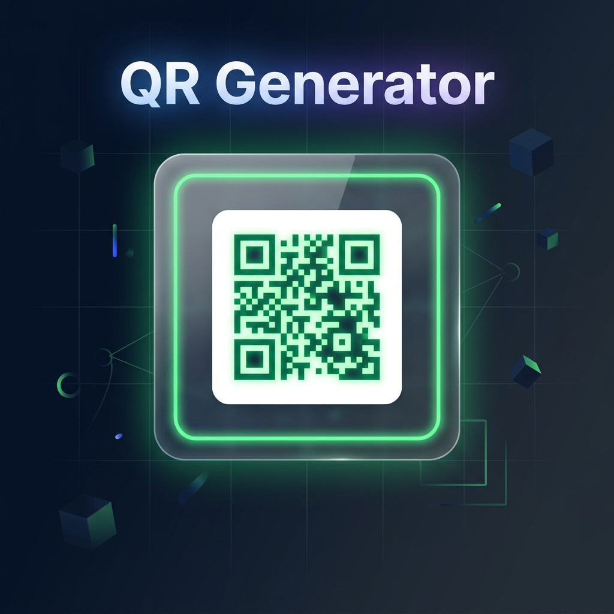

<div align="center">



<br/>

<h1>⚡ QR Generator</h1>

<p>
  <strong>A sleek, blazing-fast QR Code Generator built with Python &amp; Flask.</strong><br/>
  Instantly convert any URL, text, or contact info into a scannable QR code — right from your browser.
</p>

<br/>


<br/>

</div>

---

## ✨ Features

- 🚀 **Instant Generation** — QR codes render in real-time on form submit
- 🎨 **Custom Styled QR** — Neon green modules on a clean white canvas
- 🌐 **Versatile Input** — Works with URLs, plain text, contact info, and more
- 🖥️ **Browser-Based UI** — No install needed on the client side
- 🔒 **Local & Private** — Everything runs on your own machine; no data is sent to external servers
- 💎 **Glassmorphism Design** — Dark-themed frosted glass card UI for a premium look

---

## 🛠️ Tech Stack


| Layer | Technology |
|-------|-----------|
| **Backend** | Python 3 + Flask |
| **QR Engine** | `qrcode` library (Pillow backend) |
| **Frontend** | HTML5, Vanilla CSS3, JavaScript (ES6) |
| **Design** | Glassmorphism · Dark Mode · Gradient UI |

---

## 📁 Project Structure

```
QR_Generator/
│
├── main.py          # Flask server — routes & QR generation logic
├── index.html       # Frontend UI (served by Flask)
├── styles.css       # Dark glassmorphism styling
├── script.js        # Fetch API — live QR code requests
├── qr_code.png      # Sample generated QR output
└── README.md        # You're here!
```

---

## 🚀 Getting Started

### Prerequisites

Make sure you have **Python 3.8+** installed. Then install the required packages:

```bash
pip install flask qrcode[pil]
```

### Running the App

```bash
# 1. Navigate to the project folder
cd QR_Generator

# 2. Start the Flask development server
python main.py
```

> 🟢 The server will start at **http://127.0.0.1:5000**

### Using the App

1. Open your browser and go to `http://127.0.0.1:5000`
2. Type any **URL**, **text**, or **message** into the input box
3. Click **Generate** — your QR code appears instantly!

---

## 🔌 API Reference

The Flask backend exposes a simple REST endpoint for QR code generation:

### `GET /generate-qr`

Generates a QR code image for the given text.

| Parameter | Type | Default | Description |
|-----------|------|---------|-------------|
| `text` | `string` | `https://example.com` | The content to encode in the QR code |

**Example Request:**
```
GET /generate-qr?text=https://github.com
```

**Response:** Returns a `PNG` image (`image/png`) of the QR code.

---

## ⚙️ How It Works

```
User Input (Browser)
       │
       ▼
  script.js  ──── GET /generate-qr?text=<input> ────▶  Flask (main.py)
                                                              │
                                                              ▼
                                                    qrcode library generates
                                                    PNG image in-memory (BytesIO)
                                                              │
                                                              ▼
  Browser displays QR image  ◀──────── Returns image/png ────┘
```

- The frontend sends the user's input as a query parameter to `/generate-qr`.
- Flask uses the `qrcode` library to generate a QR image **in-memory** (no disk writes).
- The image is streamed directly back as a PNG response.
- The browser renders it in the `` tag in real time.

---

## 🎨 UI Preview

The interface features a **dark glassmorphism card** centered on a deep navy gradient background:

- **Input field** — pill-shaped, clean and minimal
- **Generate button** — gradient from sky blue `#38bdf8` to indigo `#6366f1`
- **QR display area** — centred output with neon green `#6aff9b` code modules

---

## 📦 Dependencies

| Package | Purpose |
|---------|---------|
| `flask` | Web server & routing |
| `qrcode` | QR code generation |
| `Pillow` | Image creation backend (required by `qrcode[pil]`) |

Install all at once:
```bash
pip install flask qrcode[pil]
```

---

## 🤝 Contributing

Contributions, issues, and feature requests are welcome!

1. Fork the repository
2. Create your feature branch: `git checkout -b feature/amazing-feature`
3. Commit your changes: `git commit -m 'Add amazing feature'`
4. Push to the branch: `git push origin feature/amazing-feature`
5. Open a Pull Request

---

## 📄 License

This project is licensed under the **MIT License** — see the [LICENSE](LICENSE) file for details.

---

<div align="center">

Made with ❤️ as a BCA Minor Project

⭐ Star this repo if you found it useful!

</div>
